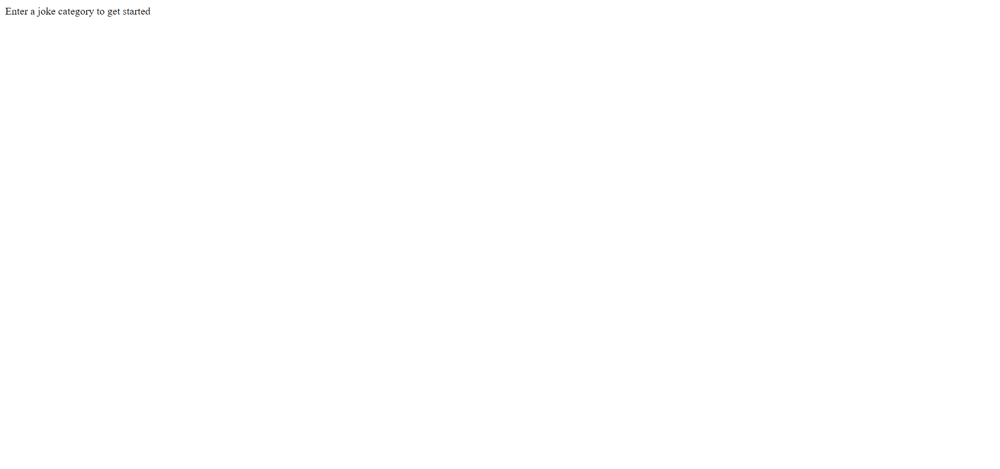
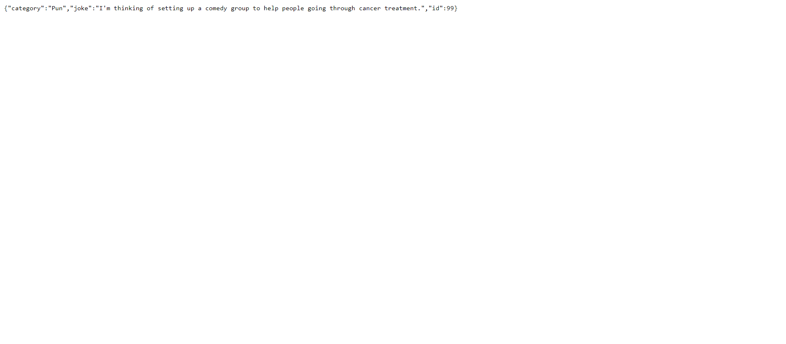
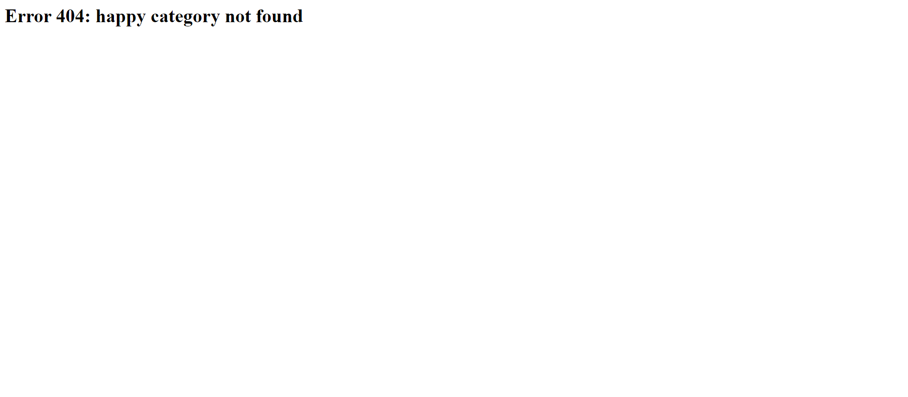
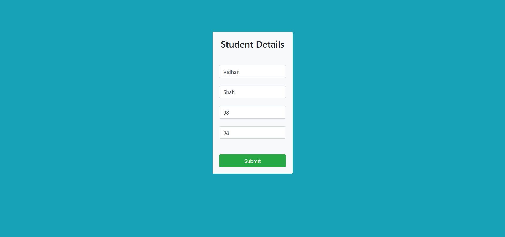
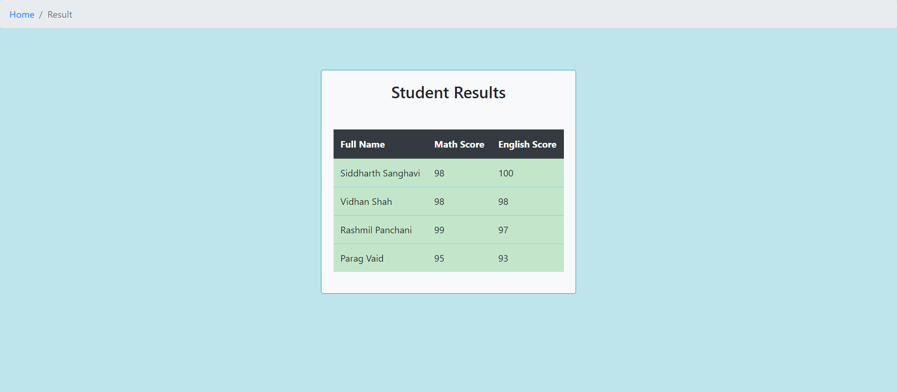

# Unicode-Backend

Backend tasks consisting of : 

1. myFunction.js : A function in JavasScript that takes a list of strings as a parameter, each value in the list is a string with 4 words separated by space and returns a list of objects which is sorted in descending order based on the average score.
2. jokes.js : A function in JavasScript that will uses a Jokes API to fetch jokes based on the category provided. 
3. app.js :  A simple HTML form which accepts the name of the student, the student’s scores in Maths and English. Once the details are entered and the submit button is clicked, the form redirects to a page where it displays the list of all the students with their details sorted on the basis of their average score.
4. app2.js : Similar function as app.js, but retrieves and inserts data to and from a database. 

## Getting Started

To install required dependencies
```bash
npm install
```

For task 4
Install MongoDB Community Edition and run it by executing mongod

## Screenshots

### Task 2 



#### After entering a valid category



#### After entering an invalid category




### Task 3 and 4 

#### Before submitting



#### After submitting



